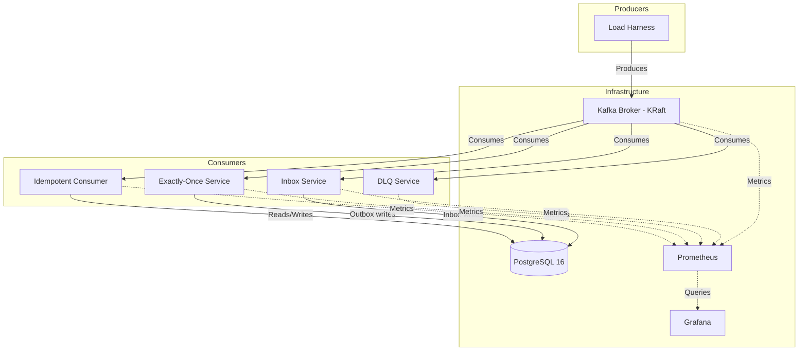
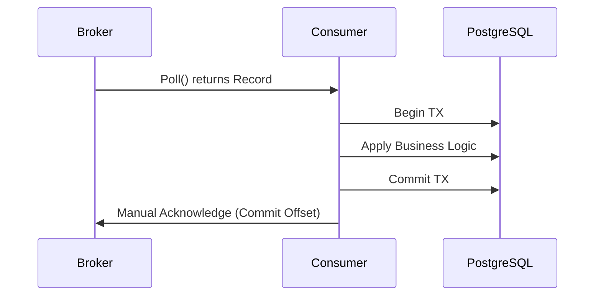
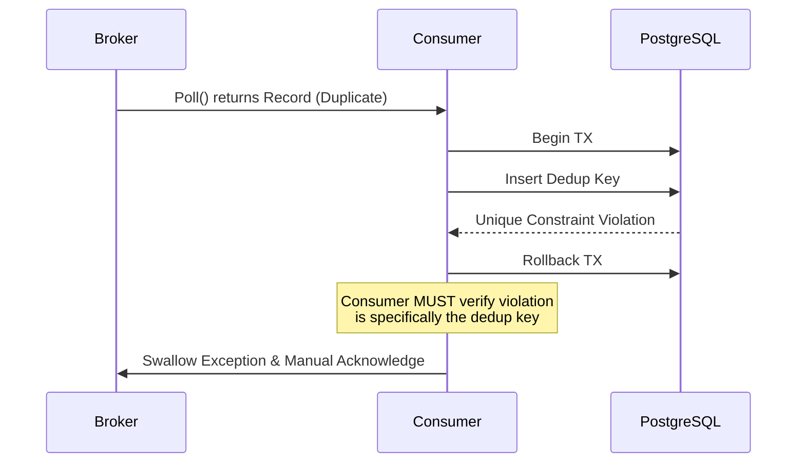
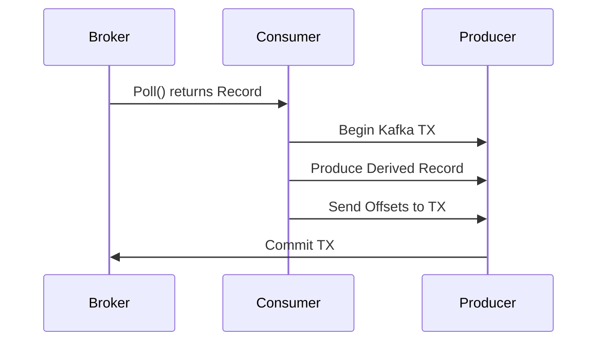
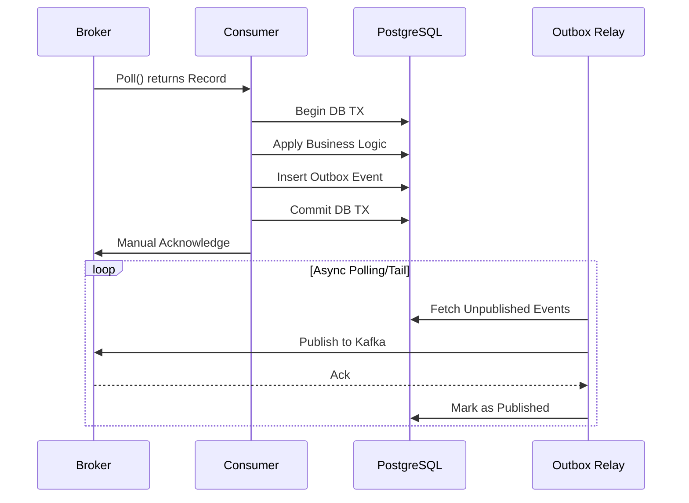
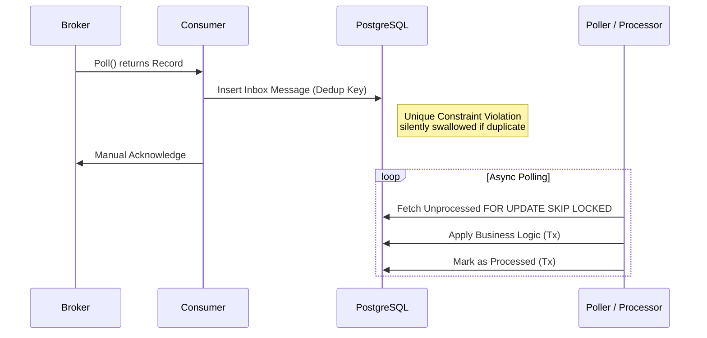
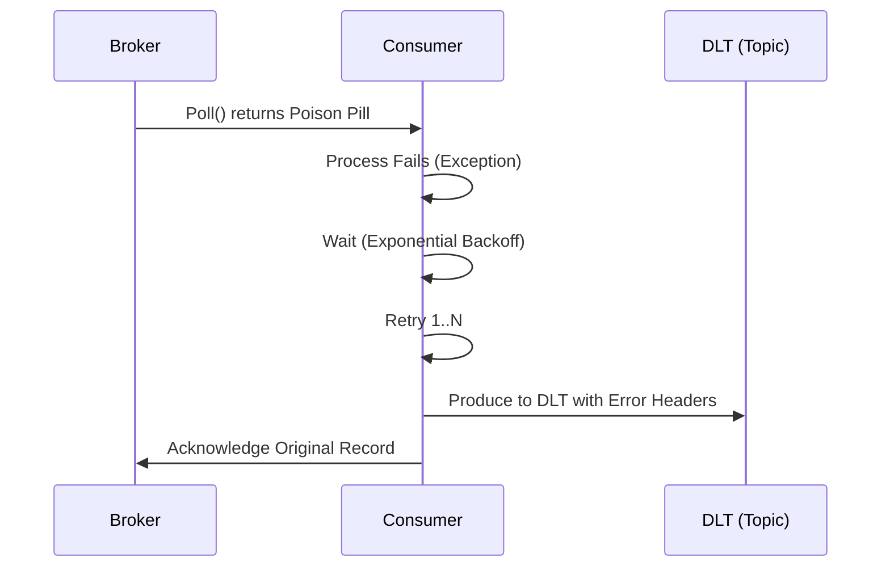

# High-Level Design: Kafka Production Patterns

## 1. Context and Goals
This reference repository demonstrates five production-grade Apache Kafka patterns in Java using Spring Boot. It provides a foundation for robust, observable, and resilient event-driven architectures.

### Goals
- Prove **Idempotent Consumers** to handle redeliveries safely.
- Prove **Exactly-Once Semantics (EOS)** for Kafka-to-Kafka and Kafka-to-Database workloads.
- Implement a robust **Dead-Letter-Queue (DLQ)** with intelligent routing and replay.
- Expose **Consumer-Lag Observability** for operational readiness.
- Prove **Transactional Inbox** for decoupled ingestion and async idempotency.

### Non-Goals
- Cross-cluster replication (e.g., MirrorMaker 2).
- Schema evolution policies and Schema Registry deployment.
- High-performance tuning (e.g., batching optimizations for million-message throughput).
- Kubernetes deployment manifests (Docker Compose is used for local validation).
- **Kafka Security (TLS/SASL/ACLs)**: This repo demonstrates logic patterns, not infrastructure hardening.
- **Distributed Tracing (e.g., Micrometer Tracing)**: Correlation IDs and span propagation are omitted to keep the code focused.

---

## 2. Pattern Map

| Pattern | Problem Solved | Failure Prevented | Guarantee Provided |
|---------|----------------|-------------------|--------------------|
| **Idempotent Consumer** | Duplicate message deliveries due to network retries or consumer rebalances. | Unintended duplicate state changes (e.g., charging a user twice). | At-least-once delivery with exactly-once side effects. |
| **Exactly-Once Semantics** | Inconsistent state during read-process-write cycles and dual-write anomalies. | Partial commits or lost messages when components fail mid-transaction. | Exactly-once processing (Kafka-to-Kafka) and eventual consistency (Outbox). |
| **Dead-Letter-Queue** | Poison pill messages blocking partitions. | Infinite retry loops causing massive consumer lag. | Fault tolerance, topic unblocking, and replayability. |
| **Lag Observability** | Invisible buildup of unprocessed messages. | Silent system failure and breached SLAs. | Operational visibility and alerting on processing delays. |
| **Transactional Inbox** | Slow processing blocking partitions and duplicate messages. | Rebalance loops from slow execution and idempotency failures. | Decoupled fast ingestion and async exactly-once business execution. |

---

## 3. Delivery Semantics Table

| Semantics | Description | Demonstrated In | Configuration Flags (Key) |
|-----------|-------------|-----------------|---------------------------|
| **At-Most-Once** | Message may be lost but never redelivered. | N/A | `enable.auto.commit=true`, `acks=0` |
| **At-Least-Once** | Message is never lost but may be redelivered. | `idempotent-consumer` | `enable.auto.commit=false`, `acks=all`, Manual Ack |
| **Exactly-Once (Kafka)**| Message processed exactly once end-to-end. | `exactly-once` | `transactional.id`, `isolation.level=read_committed` |

*Note: Kafka EOS strictly applies to Kafka-to-Kafka pipelines. For external sinks like PostgreSQL, we implement the Transactional Outbox pattern.*

---

## 4. Context Diagram
*(Diagrams are generated using Mermaid)*

---

## 5. Topic Design

Topics are designed with high availability and scalability in mind:

| Topic Pattern | Partitions | RF | Key Strategy | Retention | Rationale |
|---------------|------------|----|--------------|-----------|-----------|
| `*.events` | 3 | 1 (local) | Business ID (e.g., `orderId`) | 7 Days | Keys guarantee ordering per entity. Partitions allow concurrency. |
| `*.DLT` | 3 | 1 (local) | Same as original | 30 Days | Extended retention for operational recovery and manual replay. |

*Why Keys Matter*: Kafka guarantees ordering only within a single partition. Using a stable business key (like an Order ID) ensures all events for that entity are processed in strict chronological order, which is critical for state machines and idempotency.

---

## 6. Data-Flow Diagrams

### Happy-Path Consume + Commit

### Duplicate-Delivery Dedup Path (Idempotent Consumer)

### Transactional Read-Process-Write (Kafka-to-Kafka)

### Transactional Outbox (EOS for External Sinks)

### Transactional Inbox (Decoupled Idempotency)

### Retry -> Backoff -> DLQ

---

## 7. Trade-offs

- **Throughput Cost of EOS**: Enabling transactional producers introduces overhead (fetching producer IDs, committing transaction markers). This reduces overall maximum throughput compared to at-least-once semantics.
- **Latency Cost of Idempotency**: Synchronous database checks for deduplication (e.g., verifying a unique constraint) add a database roundtrip to the critical processing path.
- **Storage Cost**: Implementing the `processed_message` table for idempotency and the `outbox_event` table for the Outbox pattern increases the storage footprint in PostgreSQL. Old records require a cron-based cleanup mechanism.
