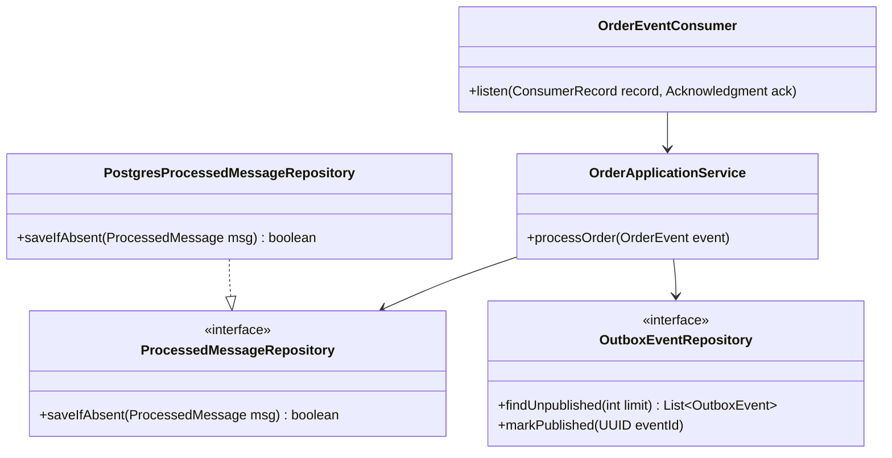
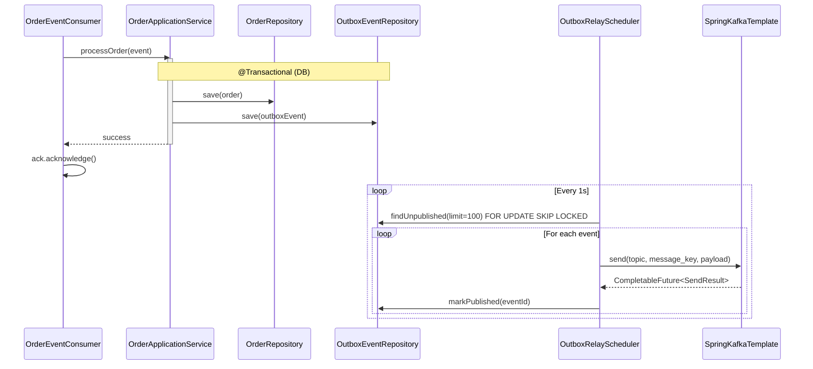
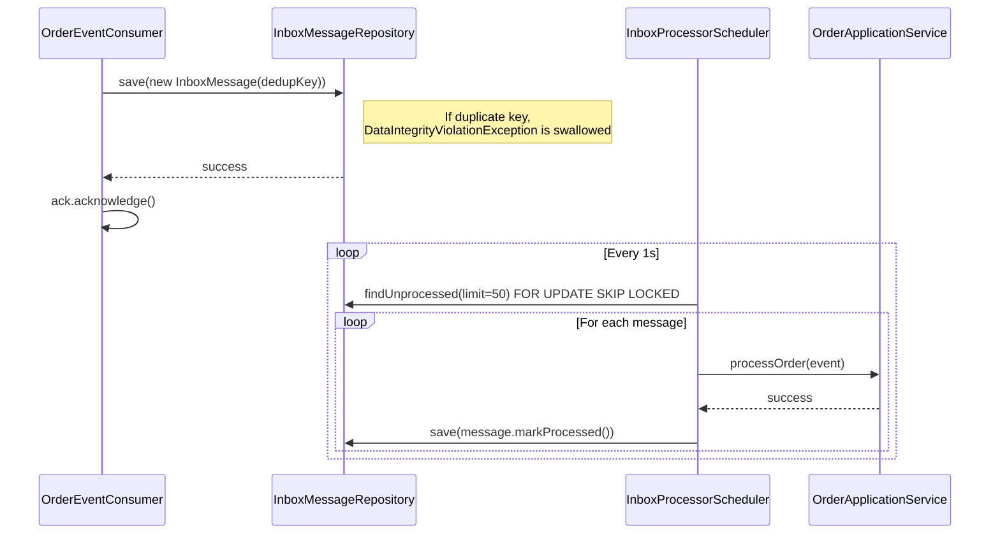

# Low-Level Design: Kafka Production Patterns

## 1. Class and Interface Design
Each pattern module follows a standardized package structure enforcing strong boundaries between domain, infrastructure, and configuration.

### Package Boundaries
- `com.example.kafka.domain`: Core business entities, ports (interfaces), and exceptions. Independent of Kafka or Spring.
- `com.example.kafka.infrastructure`: Adapters for Kafka (consumers, producers) and PostgreSQL (repositories).
- `com.example.kafka.application`: Use cases orchestrating domain logic and infrastructure components.
- `com.example.kafka.config`: Spring configuration and bean definitions.

### Class Diagram (Idempotent Consumer Example)


## 2. Sequence Diagrams (Method Granularity)

### Outbox Pattern (Exactly-Once External Sink)


### Inbox Pattern (Decoupled Idempotency)


## 3. Database Schema (DDL)

```sql
-- Idempotency Store
CREATE TABLE processed_message (
    dedup_key VARCHAR(255) PRIMARY KEY,
    processed_at TIMESTAMP WITH TIME ZONE DEFAULT CURRENT_TIMESTAMP
);
-- Rationale: The dedup_key is a composite of 'topic-partition-offset' or 'business_id-event_type'.
-- The PRIMARY KEY constraint acts as our concurrency-safe existence check.

-- Transactional Outbox
CREATE TABLE outbox_event (
    event_id UUID PRIMARY KEY,
    aggregate_type VARCHAR(100) NOT NULL,
    aggregate_id VARCHAR(255) NOT NULL,
    topic VARCHAR(255) NOT NULL,
    message_key VARCHAR(255) NOT NULL,
    payload JSONB NOT NULL,
    created_at TIMESTAMP WITH TIME ZONE DEFAULT CURRENT_TIMESTAMP,
    published_at TIMESTAMP WITH TIME ZONE
);
-- Index for the relay polling query (fetch unpublished, sorted by creation)
CREATE INDEX idx_outbox_unpublished ON outbox_event (created_at) WHERE published_at IS NULL;
-- Rationale: Partial index drastically speeds up the polling query. 
-- The relay MUST use `SELECT ... FOR UPDATE SKIP LOCKED` to prevent multi-instance collisions.

-- Transactional Inbox (Decoupled Idempotency)
CREATE TABLE inbox_message (
    message_id VARCHAR(255) PRIMARY KEY,
    payload JSONB NOT NULL,
    created_at TIMESTAMP WITH TIME ZONE DEFAULT CURRENT_TIMESTAMP,
    processed_at TIMESTAMP WITH TIME ZONE
);
-- Index for the poller query (fetch unprocessed, sorted by creation)
CREATE INDEX idx_inbox_unprocessed ON inbox_message (created_at) WHERE processed_at IS NULL;
```

## 4. Config Surface

### Consumer Defaults
| Property | Value | Why |
|----------|-------|-----|
| `enable.auto.commit` | `false` | Required for at-least-once delivery; auto-commit risks data loss on crash. |
| `isolation.level` | `read_committed` | Prevents consuming dirty/aborted transactional messages. |
| `auto.offset.reset` | `earliest` | Guarantees no messages are missed if a new consumer group is created. |
| `max.poll.records` | `50` | Lowers the risk of exceeding `max.poll.interval.ms` during heavy processing. |

### Producer Defaults
| Property | Value | Why |
|----------|-------|-----|
| `enable.idempotence` | `true` | Prevents duplicate batches on network retries. |
| `acks` | `all` | Guarantees durability across replicas before acknowledging the producer. |
| `transactional.id` | `tx-producer-${uuid}` | Required for Exactly-Once Kafka-to-Kafka transactions. |
| `max.in.flight.requests.per.connection` | `5` | Safe maximum when idempotence is enabled to preserve ordering. |

## 5. Error Taxonomy

The application uses a sealed class hierarchy to strictly categorize exceptions, driving the DLQ routing logic.

```java
public abstract sealed class ProcessingException extends RuntimeException 
    permits RetryableException, NonRetryableException { 
    public ProcessingException(String message) { super(message); }
    public ProcessingException(String message, Throwable cause) { super(message, cause); }
}

public final class RetryableException extends ProcessingException {
    public RetryableException(String message) { super(message); }
    public RetryableException(String message, Throwable cause) { super(message, cause); }
    // Thrown for: optimistic locking failures, database connection timeouts, external API 503s.
    // Action: DefaultErrorHandler intercepts, applies exponential backoff, and retries.
}

public final class NonRetryableException extends ProcessingException {
    public NonRetryableException(String message) { super(message); }
    public NonRetryableException(String message, Throwable cause) { super(message, cause); }
    // Thrown for: deserialization errors, validation constraints, unknown business state.
    // Action: Caught immediately, logged, and routed directly to the DLT (no retries).
}
```

## 6. Threading and Ordering Model

- **Concurrency**: `ConcurrentKafkaListenerContainerFactory` is set with `concurrency = 3` (matching partition count).
- **Partition Assignment**: Spring Kafka assigns 1 partition per thread.
- **Ordering Guarantee**: Kafka guarantees ordering within a partition. Because messages use a stable business key (`orderId`), all events for an entity land on the same partition. The single thread assigned to that partition processes the entity's events sequentially.
- **Async Execution**: We avoid `CompletableFuture.runAsync` inside the listener to maintain strict partition-level ordering and to tie the acknowledgment to the main listener thread.

## 7. Test Plan

All tests execute against real Kafka and PostgreSQL instances via Testcontainers.

| Pattern | Test Scenario | Verification |
|---------|---------------|--------------|
| **Idempotent** | Produce same record twice using a duplicate key. | Assert `processed_message` table has 1 row. Assert business state updated exactly once. |
| **EOS (Outbox)** | Process message, insert outbox, simulate crash before Kafka ack. Wait for redelivery. | Assert outbox contains exactly 1 event. Assert relay publishes exactly 1 message downstream. |
| **DLQ (Retry)** | Mock DB to throw `TimeoutException` twice, then succeed. | Assert record processed successfully on 3rd attempt. Assert no records in DLT. |
| **DLQ (Poison)**| Send malformed JSON payload. | Assert record lands immediately in `<topic>.DLT` with `x-exception-type` header. Assert 0 retries. |
| **Lag Metrics** | Produce 100 messages to a paused consumer. | Assert `records-lag-max` gauge reads 100 in the Micrometer registry. |
